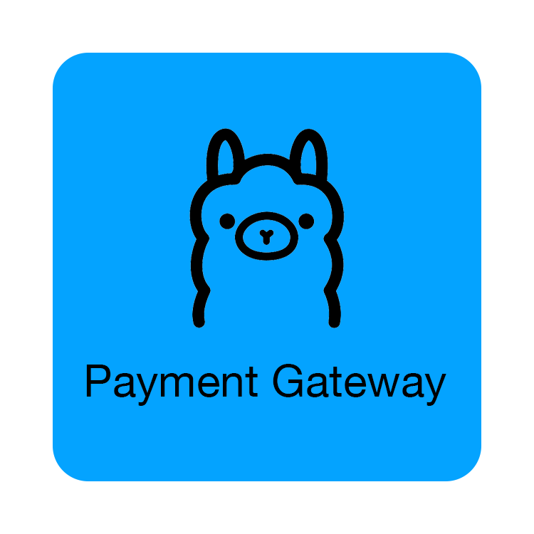

# Paid LLM Inference Gateway



This is a single Go binary that fronts an entire Ollama HTTP API with invite-only
API keys, prepaid USDC balances, usage metering, and per-key abuse controls.

x402 is used only to fund a balance. Inference debits happen off-chain in
Postgres using integer micro-USDC values.

## Requirements

- Go 1.25 or newer
- Postgres 14 or newer
- Ollama running locally or at a configured URL
- A receiving EVM address for USDC top-ups
- A facilitator reachable by the gateway. The default is Coinbase CDP's x402
  facilitator and requires `FACILITATOR_AUTHORIZATION` from a CDP bearer token.

## Build

```sh
go build -o gateway ./cmd/gateway
```

Apply the schema once:

```sh
psql "$POSTGRES_URL" -f migrations/001_init.sql
```

Copy `config.example.env` to a protected location, replace the placeholder
`PAY_TO` and the
database credentials, then create an invite:

```sh
./gateway user add --config=/etc/payed-llm-inference/gateway.env --label=demo
```

The command prints the API key once. Store it in the client securely. The
gateway stores only its SHA-256 digest.

Start the service on Base Sepolia:

```sh
./gateway serve --config=/etc/payed-llm-inference/gateway.env
```

`NETWORK=base-sepolia` is the safe default. Use `NETWORK=base` only after
testing the complete flow with test USDC.

## API

All endpoints except `/healthz` use `Authorization: Bearer <api-key>`.
`X-API-Key` is also accepted. The gateway reserves `/v1/users/me` and
`/v1/topups`; every other Ollama `/api/*` and `/v1/*` route is authenticated and
proxied without route enumeration. This includes model management, status,
embeddings, OpenAI-compatible APIs, and new Ollama routes added later.

Request a top-up. A first request returns an x402 `402 Payment Required`
response containing the exact requested amount. An x402-aware client pays and
retries with `X-PAYMENT`; the gateway verifies, settles, and credits the
balance.

```sh
curl -i http://localhost:8080/v1/topups \
  -H "Authorization: Bearer $API_KEY" \
  -H 'Content-Type: application/json' \
  -d '{"amount":"1.00"}'
```

Inspect the current balance:

```sh
curl http://localhost:8080/v1/users/me -H "Authorization: Bearer $API_KEY"
```

Run a native Ollama generation request:

```sh
curl -N http://localhost:8080/api/generate \
  -H "Authorization: Bearer $API_KEY" \
  -H 'Content-Type: application/json' \
  -d '{"prompt":"Explain x402 in one paragraph","stream":true}'
```

OpenAI-compatible clients such as OpenCode use Ollama's native compatibility
surface, which preserves OpenAI JSON/SSE and tool-call semantics:

```sh
curl -N http://localhost:8080/v1/chat/completions \
  -H "Authorization: Bearer $API_KEY" \
  -H 'Content-Type: application/json' \
  -d '{"model":"ignored-by-gateway","messages":[{"role":"user","content":"Explain x402 in one paragraph"}],"stream":true}'
```

The gateway pins billable requests to the configured Ollama model and applies
the configured generation safety ceiling (`num_predict` for native requests and
`max_tokens`/`max_output_tokens` for OpenAI-compatible requests). Native
generation remains Ollama NDJSON. OpenAI-compatible generation remains SSE.
Before calling Ollama, the gateway reserves enough local balance for the capped
output limit. It bills exact reported usage at completion and releases the
unused reservation. This keeps streams byte-compatible and prevents output from
being delivered when the account cannot cover its requested maximum.

### Complete Ollama Proxy

The gateway uses a standard-library `httputil.ReverseProxy` for non-billable
routes. It preserves the request method, path, query string, body, ordinary
headers, response status, response headers, and streaming bytes. Gateway
credentials and payment headers are removed before the request reaches Ollama.

Known compute routes receive the same protocol-compatible upstream payloads and
frames with an additional admission/metering layer:

- Native generation: `/api/generate`, `/api/chat`, and the `/v1/generate`
  compatibility alias.
- Metered native embeddings: `/api/embed`.
- OpenAI-compatible generation: `/v1/chat/completions`, `/v1/completions`,
  `/v1/responses`, and `/v1/messages`.
- OpenAI-compatible embeddings: `/v1/embeddings`.

All other Ollama routes, including `/api/tags`, `/api/show`, `/api/ps`,
`/api/version`, `/api/pull`, `/api/push`, `/api/create`, `/api/copy`,
`/api/delete`, blob routes, `/v1/models`, and future routes are forwarded by the
same wildcard proxy. They still require an API key and consume the key's
rate/concurrency allowance. Model-management requests are not token-billed, so
operators should issue keys and limits appropriate for the access they grant.
The legacy `/api/embeddings` endpoint is also forwarded without token billing
because its response does not report usage; use `/api/embed` or
`/v1/embeddings` for metered embeddings.

## Admin commands

```sh
./gateway user list --config=FILE
./gateway user revoke --config=FILE --key=API_KEY
./gateway user limit --config=FILE --key=API_KEY --rate=60 --concurrency=1
./gateway topup reconcile --config=FILE --key=API_KEY --amount-micro=1000000 \
  --transaction=0x... --payer=0x... --network=base-sepolia
```

The reconcile command is an operator recovery path if settlement succeeded but
the database was unavailable before crediting. Confirm the transaction on-chain
before using it.

## Deployment

`deploy/gateway.service` runs the same binary under systemd with journald
logging, restart-on-failure, and boot startup. Tunnels and reverse proxies are
intentionally outside the binary. Copy the unit to `/etc/systemd/system/`,
adjust paths and the service user, then enable it with `systemctl enable --now`.

## Structure

- `internal/payment`: x402 requirements, facilitator verification, and settlement
- `internal/ledger`: Postgres balance and audit transactions
- `internal/meter`: request reservations and final usage debit
- `internal/ollama`: request preparation, complete reverse proxying, and native/SSE stream observation
- `internal/guardrails`: per-key rate and concurrency controls
- `internal/httpapi`: HTTP contract and request orchestration
- `cmd/gateway`: server and admin CLI entry point

See `engineering-choices.md` for behavior where the planning documents leave
an implementation detail open.
